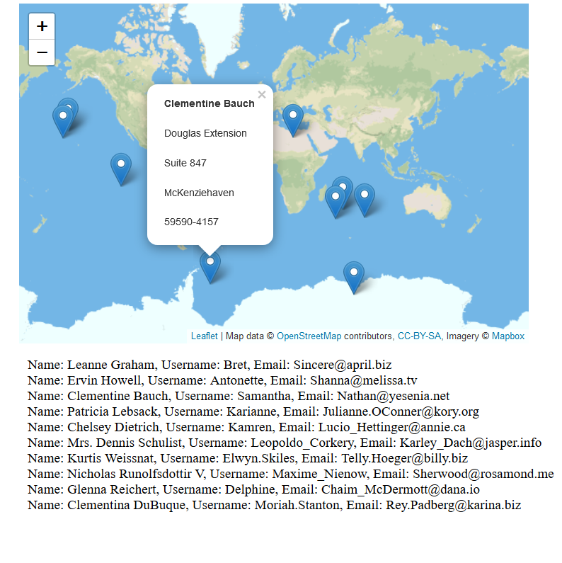

# maps 🗺️

Your assignment is to create a map displaying user information. You must us [leaflet](https://leafletjs.com/), [jsonplaceholder](https://jsonplaceholder.typicode.com/), and [axios](https://github.com/axios/axios). You may use more libraries to achieve whatever functionality you want, but I want to see that you can use at least these listed libraries and resources. The map I made and showed in class certainly was not pretty, but feel free to use CSS to improve the appearance of your own.

## instructions
Below are the high-level steps that you should be able to achieve. I'm keeping this at a high-level because I want you to fill in the details as you see fit. I think this is important for developing a feel for problem solving as well as developing your own style of coding. 

You need to:
1. Display the Map
2. Get the data for the ten users from [jsonplaceholder](https://jsonplaceholder.typicode.com/)
3. From that data, extract the latitude and longitude associated with each user
4. Display a marker on the map marking their location using the extracted lat/lon values. **Note: these locations will be in weird places, that's ok.**
5. Create a popup for the marker. When the marker is clicked, a popup should show (see the imgage below) containing information about the name and address of the user associated with that location. 
6. Display some other information for the users in a different part of the page, off the map. I chose to stuff everything below the map. I encourage (but am not requiring) you to be more creative.

# (ﾉ◕ヮ◕)ﾉ*:･ﾟ✧ version 2: make it pretty (✿◠‿◠)
make it pretty using your choice of either hand-written CSS or a CSS framework.

reference image:

